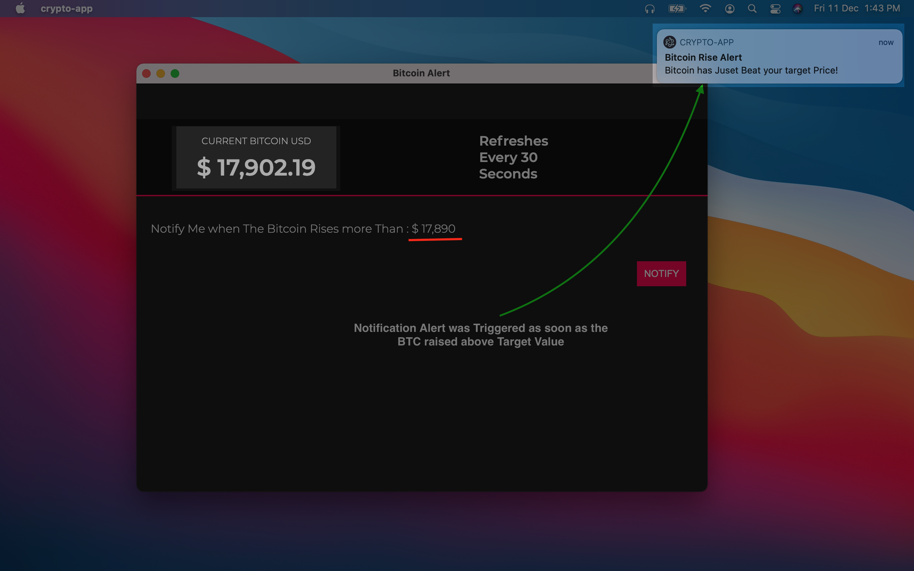

## Bitcoin Alert App.

**This App is built using Electron.js for Learning purpose** 
* Application on Launch fetches current BTC value in USD and displays on the screen
* The BTC value of USD is refreshed by fetching the API response every 30 seconds
* User can click on Notify button which will launch a child window 
* User can set a target in the Child window and click on Update 
* Application triggers a system notification whenever the BTC value of USD rises above the target given by the user in coming fetches.

Originally planned to display and set a target for BTC value of INR (Indian National Rupees) but the API provides exact value for USD and EUR. Thus changed to USD 

**App UI**

**Click On Notify**

**Enter Target Value**

**You can See Target Value Updated on Main Window**

**Alert Triggered once The Balue raises above target**

 
 
 
 
  
   
    
> This Application is created for learning purpose and reference of different resources is made to learn the concepts that are required to build this.